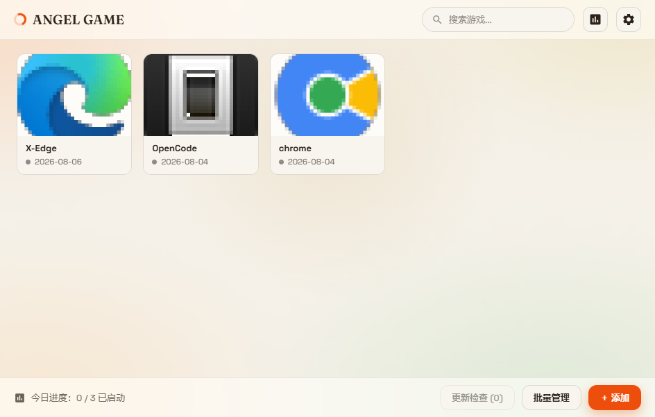
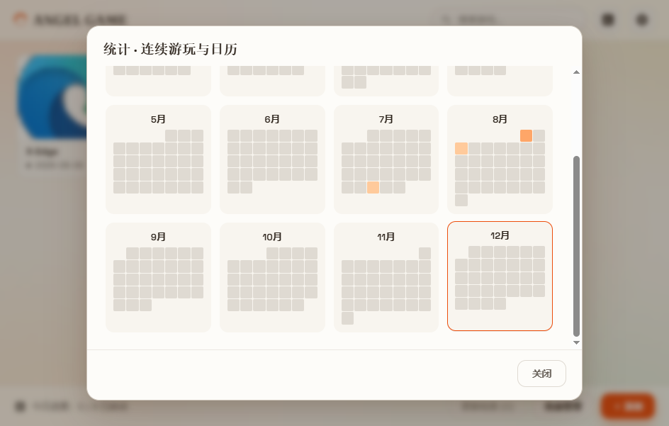

# ANGEL GAME

> 一个**本地优先**的 Windows 游戏启动与管理工具：管理你的游戏库、一键启动、记录游玩轨迹、按周期提醒检查更新。
> A **local-first** Windows game launcher & library manager: organize your library, launch with one click, track play history, and get periodic update reminders.
>
> 前端用 [pywebview](https://github.com/r0x0r/pywebview) 跑原生 HTML/CSS/JS，数据全部存在本地 SQLite，**不上云、不联网**。
> The frontend runs native HTML/CSS/JS via pywebview; all data lives in a local SQLite database — **no cloud, no network**.

---

## ✨ 功能特性 / Features

| 模块 Module | 说明 Description |
|---|---|
| **游戏库管理 / Library** | 添加 / 编辑 / 隐藏 / 删除；添加时自动从 `.exe` 提取图标作封面，也可自定义封面图。<br>Add / edit / hide / delete. Icons are auto-extracted from the `.exe` as cover; custom cover image supported. |
| **一键启动 / Launch** | 两种模式：`direct`（游戏本体）与 `launcher`（Steam / Epic / 官方启动器等平台启动器）。<br>Two modes: `direct` (game binary) and `launcher` (Steam / Epic / official launcher, etc.). |
| **今日进度 / Today** | 底部显示「今日已启动 / 活跃总数」；已启动的卡片显示「✓ 今天」角标。<br>Footer shows "launched today / total active"; launched tiles get a "✓ Today" badge. |
| **游玩统计 / Stats** | 当前连续游玩天数（streak）、历史最长连续、累计启动次数、活跃天数；**日历热力图**（按月聚合每日启动的不同游戏数，点某天就地展开当天明细）。<br>Current & longest streak, total launches, active days; a **calendar heatmap** (daily distinct-game counts per month, click a day to expand its detail). |
| **标签与筛选 / Tags & Filter** | 按标签分类、搜索框实时过滤。<br>Filter by tags; real-time search box. |
| **更新检查 / Update Check** | 每个游戏可配「启动器路径」+ 提醒周期（天）；超期卡片显示 muted「待更新」弱角标；卡片右键「🔄 检查启动器更新」用启动器模式启动并标记；底部「更新检查 (N)」汇总待检查项，支持单查 / 全部检查（**不污染游玩统计**）。<br>Per-game launcher path + remind interval (days); overdue tiles show a muted "update" badge; right-click "🔄 Check for update" launches the launcher and marks it checked; footer "Update check (N)" lists due items with single / all check (**does not affect play stats**). |
| **界面与体验 / UX** | 亮 / 暗主题、网格列数可调、窗口置顶、**单实例锁**、高 DPI 适配、窗口尺寸 / 最大化记忆。<br>Light / dark theme, adjustable grid columns, always-on-top, **single-instance lock**, HiDPI aware, window size / maximize memory. |
| **数据安全 / Data Safety** | SQLite 启用 WAL 模式；数据库损坏时自动备份为 `.bak` 并重建；用户数据落到稳定目录。<br>SQLite WAL mode; a corrupt DB is auto-backed-up to `.bak` and rebuilt; user data lands in a stable directory. |

---

## 🖼 截图 / Screenshots

> 截图待补充。请将实际界面截图按以下文件名存入 [`docs/`](docs/) 目录，提交后下方图片会自动显示：
> Screenshots to be added. Save actual UI shots to [`docs/`](docs/) with the filenames below; they will render automatically once committed:
>
> - `docs/preview-main.png` —— 主界面（游戏卡片网格 + 今日进度 + 底部栏 + 更新检查）<br>Main UI (game card grid + today progress + footer + update check)
> - `docs/preview-stats.png` —— 统计面板（连续游玩 + 日历热力图）<br>Stats panel (streak + calendar heatmap)




---

## 🛠 技术栈 / Tech Stack

- **语言 / Language**：Python 3.11+
- **界面 / UI**：[pywebview](https://github.com/r0x0r/pywebview)（Windows 下基于 Edge WebView2 内核）+ 原生 HTML / CSS / JS
- **存储 / Storage**：SQLite（标准库 `sqlite3`）
- **平台 API / Platform**：[pywin32](https://github.com/mhammond/pywin32)（窗口置顶、单实例互斥、资源管理器打开目录 / window topmost, single-instance mutex, Explorer "open folder"）
- **打包 / Build**：[PyInstaller](https://pyinstaller.org/)（单文件 `.exe`，UPX 压缩 / single-file `.exe`, UPX compressed）

> ⚠️ **主要支持平台：Windows 10 / 11**。代码对单实例锁、窗口置顶、DPI、打开目录等做了 Windows 专用实现，并保留非 Windows 兜底（不阻断启动），但未在其他平台验证。
> ⚠️ **Primary platform: Windows 10 / 11**. Single-instance lock, window topmost, DPI, and "open folder" are Windows-specific, with non-Windows fallbacks that don't block startup, but other platforms are untested.

---

## 📁 目录结构 / Project Structure

```
angel_game/
├── main.py                 # 入口：初始化配置/数据库，创建 pywebview 窗口，处理单实例与窗口几何记忆
│                           # Entry: init config/DB, create pywebview window, handle single-instance & geometry memory
├── config.py               # 配置读写（config.json）、路径解析（开发/打包两套）、窗口几何记忆
│                           # Config I/O (config.json), path resolution (dev/build), window geometry memory
├── database.py             # SQLite 层：建表、增删改查、启动日志、统计聚合、更新检查查询
│                           # SQLite layer: tables, CRUD, launch logs, stats aggregation, update-check queries
├── launcher.py             # 启动逻辑：subprocess.Popen 启动 + 存活检测 + 启动/更新记录
│                           # Launch logic: subprocess.Popen + liveness probe + launch/update logging
├── icon_extractor.py       # 从 .exe 提取图标 / 生成默认图标
│                           # Extract icon from .exe / generate default icon
├── ANGEL GAME v2.spec      # PyInstaller 打包规格（单文件 exe） / PyInstaller build spec (single-file exe)
├── web/
│   ├── __init__.py         # 包标记 / package marker
│   ├── app_api.py          # pywebview 后端 API（暴露给 window.pywebview.api 的 js_api）
│                           # pywebview backend API (exposed as window.pywebview.api js_api)
│   └── index.html          # 前端界面（HTML/CSS/JS，卡片网格 + 统计面板 + 设置）
│                           # Frontend (HTML/CSS/JS: card grid + stats panel + settings)
├── assets/
│   ├── icon.ico            # 程序图标（打包用） / app icon (build)
│   └── default_icon.png    # 默认封面模板 / default cover template
├── data/                   # 运行时数据（开发模式；打包后落到 %APPDATA%/ANGEL GAME/）— 不提交
│                           # Runtime data (dev mode; after build → %APPDATA%/ANGEL GAME/) — not committed
│   ├── angel_game.db       # SQLite 数据库（games + launch_logs）
│   └── icons/              # 提取/缓存的封面与图标 / extracted & cached covers/icons
├── history/                # 统计面板月份 JSON 缓存 — 不提交 / stats panel month JSON cache — not committed
├── config.json             # 用户配置（运行时生成/补全）— 不提交 / user config (generated) — not committed
├── window_geometry.json    # 窗口尺寸/最大化记录 — 不提交 / window geometry record — not committed
└── dist/                   # 打包产物 ANGEL GAME v2.exe — 不提交 / build output — not committed
```

---

## 🚀 快速开始 / Quick Start

### 环境要求 / Requirements

- Windows 10 / 11
- Python 3.11+
- Microsoft Edge **WebView2 Runtime**（Win10/11 通常已预装；缺失时运行会报错，需单独安装）<br>Usually preinstalled on Win10/11; install separately if missing (runtime errors otherwise).

### 安装依赖 / Install

```bash
pip install -r requirements.txt
```

### 运行（开发模式）/ Run (dev)

```bash
python main.py          # 正常模式，加载本地游戏库 / normal mode, loads local library
python main.py --demo   # 演示模式：自动注入示例游戏（用 notepad.exe 作启动目标），无需真实游戏即可体验
                        # demo mode: injects sample games (notepad.exe as target), no real games needed
```

### 打包为可执行文件 / Build

```bash
pyinstaller "ANGEL GAME v2.spec" --noconfirm
```

产物位于 `dist/ANGEL GAME v2.exe`（单文件，双击即运行，无需 Python 环境）。
Output: `dist/ANGEL GAME v2.exe` (single file, runs by double-click, no Python needed).
打包时会自动收集 `web/`、`assets/` 与 `webview` 运行时依赖。
The build auto-collects `web/`, `assets/`, and `webview` runtime deps.

---

## 📖 使用说明 / Usage

1. **添加游戏 / Add a game**：点「添加」，填游戏名称与启动程序（`.exe`）；可选填「游戏本体」(direct 目标) 与「启动器路径」(launcher 目标)，上传封面，打标签。<br>Click "Add", fill name & launcher (`.exe`); optionally set "game binary" (direct) and "launcher path" (launcher), upload a cover, add tags.
2. **启动 / Launch**：双击卡片或点启动按钮。默认 `direct` 模式跑游戏本体；若游戏需在平台启动器内更新/验证，请在编辑里填「启动器路径」，改用右键「检查启动器更新」或该模式启动。<br>Double-click the tile or the launch button. Default `direct` runs the binary; if the game must update/verify inside its platform launcher, set "launcher path" and use right-click "check for update" or that mode.
3. **检查更新 / Check update**：编辑游戏并填入「启动器路径」+ 提醒周期（天，默认 3）。超期后卡片左上角出现 muted「待更新」角标，右键「🔄 检查启动器更新」会拉起启动器并标记已检查（不计入今日进度）；底部「更新检查 (N)」可一次查看全部待检查项并单查 / 全查。<br>Edit a game and set "launcher path" + interval (days, default 3). When overdue, a muted "update" badge appears; right-click launches the launcher and marks checked (not counted in today's progress); footer "Update check (N)" lists all due items for single / all check.
4. **统计面板 / Stats panel**：查看连续游玩、总览与日历热力图；点某天展开当天各游戏的启动明细。<br>View streak, overview, and calendar heatmap; click a day to expand per-game detail.
5. **设置 / Settings**：切换亮 / 暗主题、调整网格列数、开关窗口置顶。窗口尺寸与最大化状态会自动记忆。<br>Toggle light / dark theme, adjust grid columns, toggle always-on-top. Window size & maximize state are remembered.

---

## ⚙️ 配置（`config.json`）/ Configuration

运行时生成于用户数据目录，缺失或损坏会自动用默认值重建并补全字段。生效配置项：
Generated at the user data dir at runtime; missing/corrupt files are auto-rebuilt with defaults and merged. Effective keys:

| 键 Key | 说明 Description | 默认 Default |
|---|---|---|
| `update_check.default_remind_days` | 更新检查默认提醒周期（天）/ default update-check interval (days) | `3` |
| `update_check.default_launch_mode` | 默认启动模式 / default launch mode | `"direct"` |
| `window_behavior.always_on_top` | 窗口是否置顶 / window always-on-top | `false` |
| `ui.theme` | 主题：`"light"` / `"dark"` / theme | `"dark"` |
| `ui.grid_columns` | 卡片网格列数（2–10）/ grid columns (2–10) | `5` |
| `ui.tile_width` / `ui.tile_height` | 卡片尺寸（px）/ tile size (px) | `180` / `220` |

> 注：配置文件中可能还存在 `scan_directories`、`exclude_patterns`、`launcher_detection` 等字段，为后续「目录扫描自动入库」功能的预留，**当前版本未读取**，可忽略。
> Note: the file may also contain `scan_directories`, `exclude_patterns`, `launcher_detection`, etc. — reserved for a future "scan directory to import" feature, **not read by the current version**; safe to ignore.

---

## 💾 数据存储 / Data Storage

- **开发模式 / Dev mode**：用户数据位于项目根目录 —— `data/angel_game.db`、`data/icons/`、`config.json`、`window_geometry.json`、`history/`、运行时生成的 `assets/default_icon.png`。
  User data lives in the project root — `data/angel_game.db`, `data/icons/`, `config.json`, `window_geometry.json`, `history/`, and a runtime-generated `assets/default_icon.png`.
- **打包后 / After build**：数据落到稳定的 `%APPDATA%/ANGEL GAME/`（跨运行持久），只读资源模板取自 exe 内部。
  Data lands in the stable `%APPDATA%/ANGEL GAME/` (persists across runs); read-only resource templates come from inside the exe.
- **数据库表 / Tables**：
  - `games`：游戏信息（名称、exe 路径、启动器路径、封面/图标、最后启动、更新检查时间、提醒周期、标签、隐藏标记）。<br>Game info (name, exe path, launcher path, cover/icon, last launched, last update check, remind interval, tags, hidden flag).
  - `launch_logs`：启动日志（`game_id`、`launched_at`、`launch_mode`），外键级联，删除游戏时一并清除。<br>Launch log (`game_id`, `launched_at`, `launch_mode`); foreign-key cascade, cleared when the game is deleted.

---

## ❓ 常见问题 / FAQ

- **`ModuleNotFoundError: No module named 'webview'`** → 未安装依赖，执行 `pip install -r requirements.txt`。<br>Missing deps — run `pip install -r requirements.txt`.
- **窗口白屏 / 报错 WebView2 相关** → 系统缺 Edge WebView2 Runtime，到微软官网安装后重试。<br>Missing Edge WebView2 Runtime — install it from Microsoft, then retry.
- **数据库损坏 / DB corrupted** → 程序会自动备份原库为 `angel_game.db.bak` 并重建（重建后数据清空，旧备份可手动恢复）。<br>The app auto-backs-up the old DB to `angel_game.db.bak` and rebuilds (data cleared; the old backup can be restored manually).
- **重复双击只弹出一个窗口** → 单实例锁生效，重复启动会激活已存在的窗口而非新开。<br>Single-instance lock active; repeated launches activate the existing window instead of opening a new one.
- **想重新打包却找不到入口** → 使用 `ANGEL GAME v2.spec`，不要使用旧版 `ANGEL GAME.spec`（已移除）。<br>Use `ANGEL GAME v2.spec`; the old `ANGEL GAME.spec` was removed.

---

## 📌 版本 / Version

- **v2.x（当前 / current）**：接入「检查启动器更新」完整链路（启动器路径录入 → 超期判定 → 卡片弱角标 → 右键检查 → 全局待检查面板），清理旧版遗留的打包/原型/测试残留。<br>Wired up the full "check for launcher update" flow (launcher path entry → overdue check → tile badge → right-click check → global due-list panel); cleaned legacy build/prototype/test leftovers.
- 早期版本为纯游戏库 + 启动统计（P0–P9 渐进式迭代）。<br>Earlier versions were a pure library + launch stats (incremental P0–P9 iterations).

---

## 📄 许可证 / License

[MIT License](LICENSE) — 可自由使用、修改、分发。如需其他协议，替换为对应 `LICENSE` 文件即可。
[MIT License](LICENSE) — free to use, modify, and distribute. To use another license, replace the `LICENSE` file.

---

## 🙏 致谢 / Acknowledgements

- [pywebview](https://github.com/r0x0r/pywebview) — 把 Web 前端装进桌面窗口 / puts a web frontend inside a desktop window
- [PyInstaller](https://pyinstaller.org/) — 单文件打包 / single-file builds
- [pywin32](https://github.com/mhammond/pywin32) — Windows 平台 API 桥接 / Windows platform API bridge
